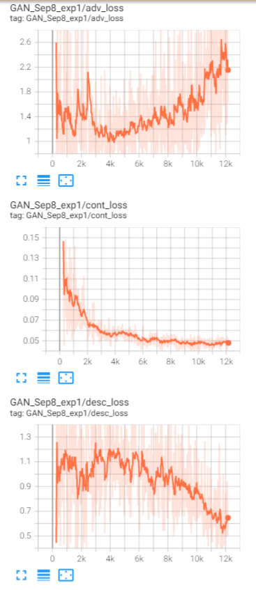
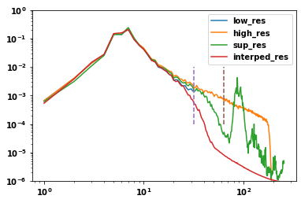
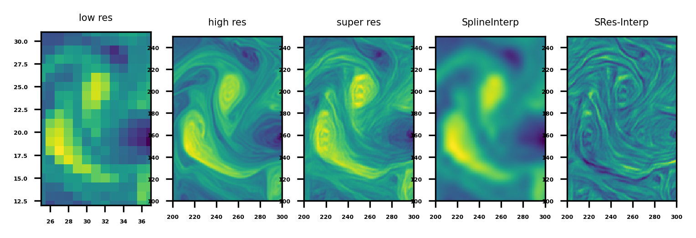
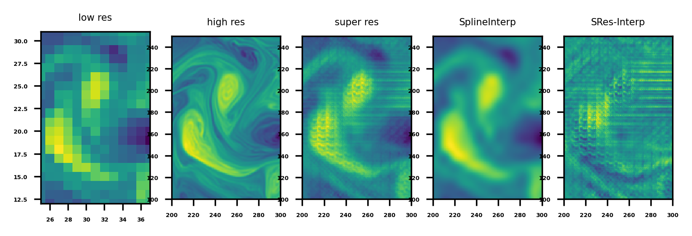

# DeepLearningCFD
Applying deep learning in Computational Fluid Dynamics

## Scripts

run_pyqg.py: produce training/testing data from QG simulation

trainer.py: train Super Resolution Deep Learning model from produced data

## Experiments
### Initial Trial
```
Generator: 16 layers; small_kernel_size=5; large_kernel_size=15
Discriminator: 8 layers; kernel_size=5
learning rate = 1e-4
scaling factor = 4x
beta = 0.01 (generator_loss = content_loss + beta * adversarial_loss)
```

First, only train generator. At epoch=30, looking at potential voriticity field and its spectrum, super-resolution result is not that different from Bivariate Spline interpolation at this time.


Continue training with GAN. At epoch 30 Small scale structure starts to show up. In this physical space, the small scale structure doesn't look realistic yet, though it fills up some gap in the spectral space.


At epoch 100


At epoch 200, now GAN super-resolution model output starts to look realstic. The fine structure is very close to the high resolution image. I was expecting the super-resolution model to generate some realistic fine structure, but not in the exact same location as the actual high resolution image as this information could be lost in the low resolution image. But at 4x scaling factor, it could be the case that most information is still preserved. GAN helps the model to focus on learning small scale structure. This can also been seen from 


At epoch 400, the GAN super-resolution output is quite realistic. It also generates some details not existing in the original high resolution image. The vorticity spectrum is very close to original high resolution image's spectrum, except at the highest wavenumber.


Learning curve. Content loss keeps decreasing, which means GAN helps generator to generate super-resolution image exactly the same as original high-resolution image. Adversarial loss decreases first, but then increases with some fluctuation.



### Exp2: increase scaling factor

Increase scaling factor to 8x. Other settings are kept the same.

First train without GAN for 200 epochs. At the end of training, the super-resolution output looks still close to interpolation result.


Then continue train with GAN. Similar to previous experiment, small scale structure quickly emerge, though it doesn't look realistic. 

At epoch 23:



At epoch 240, the model output becomes much more realistic, and the vorticity spectrum has shape close to the actual one.



However, model training is unstable. At epoch 250, the model output becomes quite bad.



The sudden collapse during model training can be clearly seen from the learning curve. Between epoch 240 and 250, there's a sudden increase of adversarial loss (first peak), at the same time, the discriminator loss goes to zero. There are two more such sudden collapses during training. It seems that the discriminator becomes too strong, and probably identifies some local feature.


### Exp2b: reducing discriminator training

In previous experiment, discriminator gets too strong. In this one, continue training from epoch 240 from previous experiment, at which time the collapse doesn't happen yet. This time, only train discriminator at half of the time.

At epoch 470, the model output looks quite realistic, though some small disturbances are absent from the original image but these are expected and desired. From learning curve, we can also see that the collapose doesn't happen.


